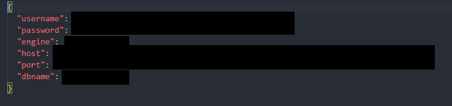

<div align="center">
  
  <h3>GAVAN</h3>
  <p><b>Super Cheap Cost Saving High Performance Migration Solution of SQL/NoSQL to BigQuery</b></p>
</div>
<br/>


# Intro
Data ingestion is a critical process in data architecture that involves collecting, importing, and processing data from various sources into a centralized system or data warehouse. It serves as the foundation for data-driven decision-making, analytics, and business intelligence. 

Data ingestion refers to the process of extracting data from multiple sources, transforming it into a consistent format, and loading it into a target system for further analysis and storage. It involves acquiring data from various structured and unstructured sources, such as databases, files, APIs, streaming platforms, and IoT devices, among others.

**Different Types of Data Ingestion**
1.  Batch Data Ingestion: Involves collecting and processing data in predefined batches or chunks. It is typically used for ingesting large volumes of historical data at regular intervals, such as daily, weekly, or monthly. Batch ingestion is well-suited for scenarios where real-time data processing is not required, and data latency is acceptable. It offers simplicity, scalability, and the ability to handle large data volumes efficiently.
    
2.  Real-time Data Ingestion: Real-time data ingestion involves the continuous collection and processing of data as it is generated. It is commonly used for streaming data sources, such as IoT devices, social media feeds, or financial market data. Real-time ingestion enables organizations to analyze and respond to data in near real-time, allowing for timely decision-making and immediate insights. It requires robust infrastructure and technologies capable of handling high-velocity data streams.
    
3.  Change Data Capture (CDC): Change Data Capture is a method used to capture and ingest only the changes made to a data source since the last ingestion. It tracks and captures data modifications, additions, or deletions, ensuring that only the updated data is ingested. CDC is particularly useful for databases where capturing and processing the entire dataset would be inefficient. It reduces the processing overhead and enables near real-time updates without reprocessing the entire dataset.
    
4.  Log-based Data Ingestion: Log-based data ingestion involves capturing and ingesting data from log files generated by various systems, applications, or devices. Logs contain valuable information about system events, user activities, errors, and more. By ingesting log data, organizations can gain insights into system performance, troubleshoot issues, and monitor user behavior. Log-based ingestion often involves parsing and extracting relevant information from log files and transforming it into a usable format.
    
Data ingestion is a crucial step in data architecture, and different types of ingestion methods cater to specific requirements and data sources. Batch ingestion is suitable for processing large volumes of historical data, while real-time ingestion enables near real-time analysis. Change Data Capture and log-based ingestion offer efficient ways to capture and ingest only the relevant data, reducing processing overhead. API-based ingestion provides flexibility and real-time access to data from external systems. Understanding the characteristics and use cases of different data ingestion types is essential for designing an effective data ingestion strategy. 
Base on this scenario, GAVAN are built to serve the needs.


# Architecture

As you can see from the [architecture design](https://red-elaina-83.tiiny.site/) , it include several types of condition that need to be provided by user so GAVAN will decide to serve on what purpose.

GAVAN will help to split the process into 2 , MAIN and CDC.

-   MAIN are normal way of ingestion that taking data from certain event time into a staging table, once done it will automatically create a final table IF expected final table not exists. IF the final table is exists, the staging table will automatically merge together with final table into newly updated final table.
    
-   CDC is as same as MAIN, the difference is CDC are creating new table everytime ingestion made, the table created keep on recreate everytime ingestion made. 
    
Both MAIN and CDC data will be combine and represent as completed final table. This completed final table is the one that used by end user or application.

# Advantages

There a several advantages on using GAVAN over other tools, below are some of it :-

- **Huge cost saving** (Apparently main factor of why GAVAN was build)
- Transparency (Issues are easy to troubleshoot and fixed)
- Easy governance
- **Support parallel processing**
- Easy modification
- **Auto schema conversion**
- **Partition/Cluster friendly**
- Detail logging
- Only require ReadOnly access from source side
- Easy integration with any Orchestration tools ( Airflow / Kubernetes / Shell etc )

## Sources
Currently, GAVAN are supporting below data sources :-

- MySQL
- PostgreSQL
- MariaDB
- Oracle
- MSSQL
- GCP Firestore
- AWS Redshift
- MongoDB
- Google Ads
- Facebook Ads
 

## Target
Currently, GAVAN only support sinking to **GCP BigQuery** 


## Example
In order to use GAVAN, you may need to provide below detail :-

-  CREDENTIAL_TARGET &rarr; Service Account to access the BigQuery side
```
{
  "type": "service_account",
  "project_id": "xxxxxxxxxxxxxxx",
  "private_key_id": "xxxxxxxxxxxxxxx",
  "private_key": "xxxxxxxxxxxxxxx",
  "client_email": "xxxxxxxxxxxxxxx",
  "client_id": "xxxxxxxxxxxxxxx",
  "auth_uri": "xxxxxxxxxxxxxxx",
  "token_uri": "xxxxxxxxxxxxxxx",
  "auth_provider_x509_cert_url": "xxxxxxxxxxxxxxx",
  "client_x509_cert_url": "xxxxxxxxxxxxxxx"
}
```

-  CREDENTIAL_SOURCE&rarr; Credential to connect to Source side
```
{
  "username": "xxxxxxxxxx",
  "password": "xxxxxxxxxx",
  "engine": "xxxxxxxxxx",
  "host": "xxxxxxxxxx",
  "port": "xxxxxxxxxx",
  "dbname": "xxxxxxxxxx"
}
```
-  SOURCE_DETAIL&rarr; Contain the expected table you want to ingestion over to target
```
[
  {
    "append": "True", # If its an append only process
    "fulldump": "True", # If want to restore fulldump from source
    "uniq_col": "Primary Key ID if have",
    "stbl": "source table name",
    "ttbl": "expected table name",
    "sdb": "source database/instance name",
    "ssch": "source schema name",
    "cond": " where something something if have ",
    "tsds": "target staging dataset",
    "tfds": "target final dataset",
    "part_col": "partition column to be choosen",
    "cluster_col": "cluster column to be choosen",
    "projectId": "target final project"
  }
]
```
-  TEMP_STORAGE&rarr; Path that GAVAN will use to dump all auto schemaset and query building
-  DAYS_TO_INGEST&rarr; Use this flag if your ingestion base on days
-  HOUR_TO_INGEST&rarr; Use this flag if your ingestion base on hours
-  MINUTE_TO_INGEST&rarr; Use this flag if your ingestion base on minutes
-  USING_TUNNEL_OR_NOT&rarr; If you require tunneling to source side
-  RECEPIENT&rarr; Who will get notification if there's failure
```
['shahril@gmail.com','shahril.k@gmail.com']
```
-  JOB_NAME&rarr; Name of this job
-  START_DT&rarr; Use this if want to ingest from specific date
-  ED_DT&rarr; Use this if want to ingest until specific date


   
Below are some of example that GAVAN can cater for several scenario
**Append**
```bash
time python main.py 
--sa {CREDENTIAL_TARGET} --secret {CREDENTIAL_SOURCE} 
--config_path {SOURCE_DETAIL} --script_folder {TEMP_STORAGE} 
--tunnel {USING_TUNNEL_OR_NOT}
--owner_task {RECEPIENT} 
--job_task {JOB_NAME}
--LOOKBACKMIN {MINUTE_TO_INGEST} 
```


**Create table schemaset on Target side only**
```bash
time python main.py 
--sa {CREDENTIAL_TARGET} --secret {CREDENTIAL_SOURCE} 
--config_path {SOURCE_DETAIL} --script_folder {TEMP_STORAGE} 
--LOOKBACKDAY {DAYS_TO_INGEST} 
--tunnel {USING_TUNNEL_OR_NOT}
--owner_task {RECEPIENT} 
--job_task {JOB_NAME} 
--first True
```

**Normal Ingestion**
```bash
time python main.py 
--sa {CREDENTIAL_TARGET} --secret {CREDENTIAL_SOURCE} 
--config_path {SOURCE_DETAIL} --script_folder {TEMP_STORAGE} 
--LOOKBACKHOUR {HOUR_TO_INGEST} 
--tunnel {USING_TUNNEL_OR_NOT}
--owner_task {RECEPIENT} 
--job_task {JOB_NAME} 
```

**Base on certain date**
```bash
time python main.py 
--sa {CREDENTIAL_TARGET} --secret {CREDENTIAL_SOURCE} 
--config_path {SOURCE_DETAIL} --script_folder {TEMP_STORAGE} 
--tunnel {USING_TUNNEL_OR_NOT}
--owner_task {RECEPIENT} 
--job_task {JOB_NAME} 
--st {START_DT} 
--ed {ED_DT} 
```
**Near real time processing**
```bash
time python main.py 
--sa {CREDENTIAL_TARGET} --secret {CREDENTIAL_SOURCE} 
--config_path {SOURCE_DETAIL} --script_folder {TEMP_STORAGE} 
--tunnel {USING_TUNNEL_OR_NOT}
--owner_task {RECEPIENT} 
--job_task {JOB_NAME} 
--realtime True 
```

**Full load data ingestion**
```bash
time python main.py 
--sa {CREDENTIAL_TARGET} --secret {CREDENTIAL_SOURCE} 
--config_path {SOURCE_DETAIL} --script_folder {TEMP_STORAGE} 
--tunnel {USING_TUNNEL_OR_NOT}
--owner_task {RECEPIENT} 
--job_task {JOB_NAME} 
```

# Cost Comparison
Currently, I've made a cost comparison on several alternative provider ( This is base on 5 TB of data active ingestion )

[Cost Comparison](https://gentle-lamington-d23729.netlify.app/)


# Screenshot





